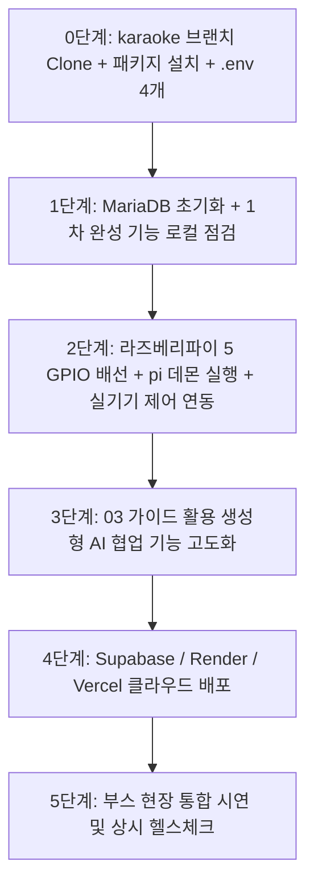

# 학생 수작업 로드맵 (2차 개발 체크리스트)

> 📂 **본편 02 / 팀 전원 / 2차 개발 진행 체크용** · 상세 설명 및 프롬프트는 [01-학생용-설치-및-사용-매뉴얼](01-학생용-설치-및-사용-매뉴얼.md) · 전체 목록 [docs/README.md](README.md)
>
> 💡 **안내**: AI에게 시키지 않고 **학생이 직접 터미널, GUI, 하드웨어 배선으로 수행해야 하는 작업**만 모아놓은 체크리스트입니다. 1차 완성된 저장소(`karaoke` 브랜치)를 클론한 후 단계별로 체크하며 진행하세요.



---

## 0단계. 깃허브 Clone 및 개발 환경 셋업 (팀당 1회)

- [ ] `git clone -b karaoke https://github.com/foxjini/agent-vibe-coding-starter-kit2.git agent-vibe-coding-starter-kit2-karaoke`
- [ ] Antigravity IDE에서 해당 폴더 열기
- [ ] Customizations → Rules에서 **3개만 Always On** 확인 (`karpathy-principles`, `security-rules`, `coding-standards`)
- [ ] **백엔드 가상환경(venv) 생성 및 패키지 설치**:
  ```powershell
  cd backend
  python -m venv venv
  .\venv\Scripts\Activate.ps1
  pip install -r requirements.txt
  cd ..
  ```
- [ ] **프론트엔드 패키지 설치**:
  ```powershell
  cd frontend
  npm install
  cd ..
  ```
- [ ] **비전(웹캠 인식) 가상환경(venv) 생성 및 패키지 설치**:
  ```powershell
  cd vision
  py -3.12 -m venv venv
  .\venv\Scripts\Activate.ps1
  pip install -r requirements.txt
  cd ..
  ```
- [ ] **환경변수 파일 4개 복사 및 `DEVICE_API_KEY` 고유값 동일 설정**:
  ```powershell
  copy backend\.env.example backend\.env
  copy frontend\.env.example frontend\.env
  copy vision\.env.example vision\.env
  copy pi\.env.example pi\.env
  ```
  *(💡 `backend/.env`, `vision/.env`, `pi/.env`의 `DEVICE_API_KEY` 값을 `karaoke_secret_key_1234` 등 동일하게 맞춥니다.)*

---

## 1단계. MariaDB 초기화 및 1차 완성 시스템 점검

- [ ] XAMPP Control Panel에서 **Apache**와 **MySQL(MariaDB)** 실행 (Start)
- [ ] DB 초기화 스크립트 실행 (노래방 부스, 디바이스 시드, 애창곡 데이터 생성):
  ```powershell
  cd backend
  Get-Content db\init.sql | mysql -u root
  cd ..
  ```
- [ ] **[터미널 1] 백엔드 서버 실행 유지**:
  ```powershell
  cd backend
  .\venv\Scripts\Activate.ps1
  uvicorn main:app --reload --port 8000
  ```
  `http://localhost:8000/docs` 및 `/health` 정상 접속 확인
- [ ] **[터미널 2] 프론트엔드 서버 실행 유지**:
  ```powershell
  cd frontend
  npm run dev
  ```
  `http://localhost:3000` 접속 후 상단 **"● 실시간 연결됨"** 배지 확인
- [ ] **[터미널 3] 비전 클라이언트(웹캠) 실행 유지**:
  ```powershell
  cd vision
  .\venv\Scripts\Activate.ps1
  python main.py
  ```
  웹캠 창에서 사람 감지 시 녹색 박스 표시 및 백엔드로 `/api/v1/vision/events` 전송 확인
- [ ] **1차 완성 핵심 기능 직접 조작 검증**:
  - [ ] 내일 날짜 예약 신청 ➔ 4자리 일회성 PIN 발급 확인 (당일 예약 차단 확인)
  - [ ] 화면 키패드에 발급된 PIN 입력 ➔ 솔레노이드 UNLOCKED + 릴레이 ON + LED ON 확인
  - [ ] 마스터 키 `9179` 입력 ➔ 도어락 UNLOCKED + LED ON (릴레이 전원 OFF 유지) 확인
  - [ ] 웹캠 사람 감지 시 대시보드 환영 안내(TTS) 자동 송출 확인
  - [ ] 노래방 반주(MR) 재생 및 마이크 음정/성량 채점 전광판 동작 확인
  - [ ] 이용 종료 시 퇴실 음악 재생 및 전원 차단 확인

---

## 2단계. 라즈베리파이 5 실기기 하드웨어 연동 (Mock ➔ Hardware)

- [ ] Windows PC IPv4 주소 확인 (`ipconfig` 실행, 예: `192.168.0.25`)
- [ ] Windows Defender 방화벽 8000 포트 인바운드 허용 (관리자 PowerShell):
  ```powershell
  netsh advfirewall firewall add rule name="fastapi-dev" dir=in action=allow protocol=TCP localport=8000
  ```
- [ ] `backend/.env`에서 `DEVICE_MODE=hardware`로 변경 후 백엔드 재시작
- [ ] **라즈베리파이 5 하드웨어 배선 (전원 차단 상태, 교사 입회 필수)**:
  - [ ] 솔레노이드 도어락 (릴레이 채널 1)
  - [ ] 노래방 기기 전원 (릴레이 채널 2)
  - [ ] 부스 안내 LED 모듈
  - [ ] 4x4 매트릭스 키패드 (8개 GPIO 핀)
  - [ ] PIR 인체감지 센서
  - [ ] 스피커 연결
- [ ] **라즈베리파이 5 패키지 설치 및 데몬 실행** (파이 터미널):
  ```bash
  sudo apt update && sudo apt install -y python3-gpiozero python3-lgpio
  cd pi
  python3 -m venv --system-site-packages venv
  source venv/bin/activate
  pip install -r requirements.txt
  ```
- [ ] `pi/.env` 파일 수정: `BACKEND_URL=http://[백엔드PC-IP]:8000`, `DEVICE_API_KEY` 일치, `GPIOZERO_PIN_FACTORY=lgpio`
- [ ] 하드웨어 배선 1분 자가진단 실행: `python test_hardware_gpio.py`
- [ ] 라즈베리파이 데몬 구동: `python main.py` (또는 `python 02_karaoke_daemon_mock.py`)
- [ ] **실기기 양방향 제어 검증**:
  - [ ] 웹 대시보드 PIN 인증 시 실제 솔레노이드 도어락 해제 및 릴레이 전원 인가 확인
  - [ ] 실물 4x4 키패드 입력 시 백엔드 인증 및 도어락 해제 동작 확인

---

## 3단계. 생성형 AI 협업 기능 고도화

- [ ] [03-2차개발-생성형AI-핸드오버-가이드.md](03-2차개발-생성형AI-핸드오버-가이드.md)를 복사하거나 AI 프롬프트에 제공
- [ ] 추가 요구사항(키패드 디바운스, 음성 안내 연동, UI 보완 등)을 AI와 최소 변경 원칙으로 구현
- [ ] 작업 완료 후 Git 커밋 (VS Code 소스 제어 GUI 활용)

---

## 4단계. 클라우드 배포

- [ ] Supabase 프로젝트 생성 및 PostgreSQL 마이그레이션 DDL 실행
- [ ] Render에 백엔드 배포 (`backend/` 디렉터리, `DATABASE_URL`, `DEVICE_API_KEY` 환경변수 등록)
- [ ] Vercel에 프론트엔드 배포 (`frontend/` 디렉터리, `NEXT_PUBLIC_API_BASE_URL` 환경변수 등록)
- [ ] 라즈베리파이 `pi/.env`의 `BACKEND_URL`을 배포된 Render 백엔드 주소(`https://...onrender.com`)로 갱신 후 데몬 재구동
- [ ] 외부 인터넷 환경에서 스마트폰으로 Vercel 접속 후 부스 제어 최종 통합 테스트

---

## 5단계. 상시 유지보수 및 점검

- [ ] 기능 추가 및 수정 시 `.agents/workflows/health-check.md` 워크플로우로 상태 점검
- [ ] 문제 발생 시 에러 로그 기반 `.agents/workflows/bugfix.md`로 외과적 수정 수행
