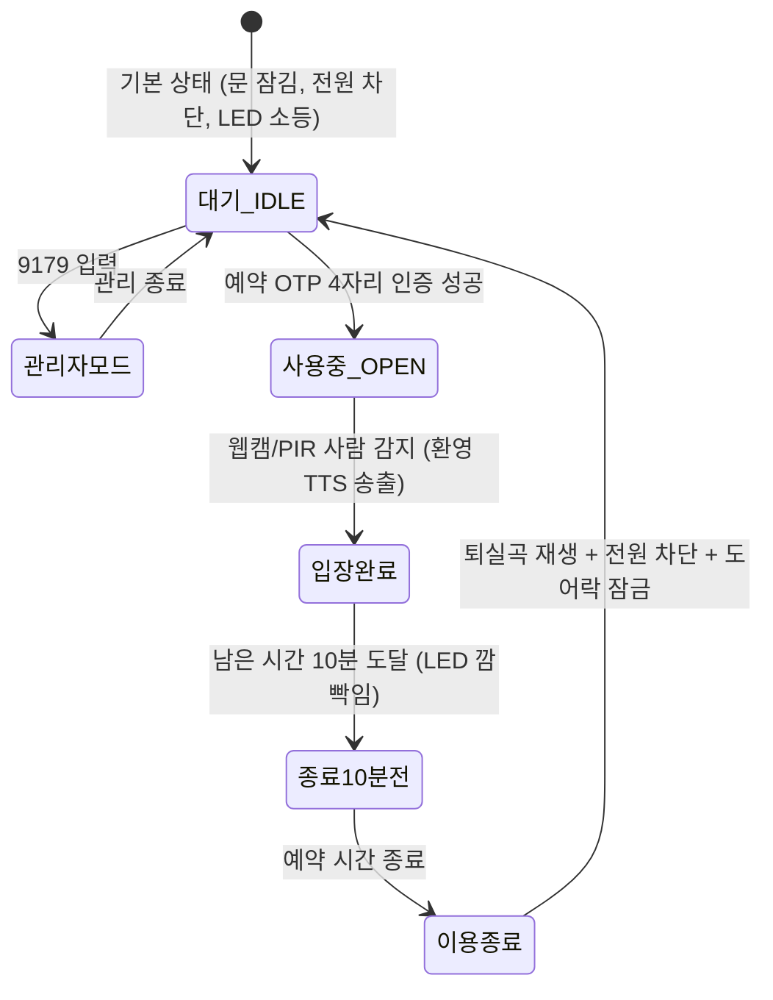

# 03. 2차 개발을 위한 생성형 AI 인수인계(Handover) 가이드

> **문서 목적**: 본 문서는 **'웹 예약 연동 자동화 학교 노래방 부스 관리 시스템'**의 1차 완성(Windows PC Mockup 환경)된 시스템을 바탕으로, 학생들이 **ChatGPT, Claude, Cursor, Antigravity 등 생성형 AI**의 도움을 받아 **2차 개발(실제 라즈베리파이 5 하드웨어 연동, 기능 고도화, 클라우드 배포)**을 막힘없이 진행할 수 있도록 작성된 종합 기술 인수인계서입니다.

---

## 💡 학생들을 위한 AI 사용 팁 (프롬프트 작성 요령)

새로운 대화 세션을 열어 생성형 AI에게 작업을 요청할 때, **항상 이 문서의 내용(또는 파일 링크)을 프롬프트 맨 처음에 제공**하세요.
```markdown
[AI에게 전달할 기본 프롬프트 시작 템플릿]
너는 우리 팀의 2차 개발을 돕는 AI 어시스턴트야.
우리 프로젝트는 '웹 예약 연동 자동화 학교 노래방 부스 관리 시스템'이고,
이미 1차 완성된 시스템 구조는 docs/03-2차개발-생성형AI-핸드오버-가이드.md 와 AGENTS.md에 완벽히 정리되어 있어.
임의로 기술 스택이나 구조를 바꾸지 말고, 기존 API 규격과 폴더 구조를 유지하면서 다음 작업을 도와줘:
[여기에 원하는 작업 내용 작성]
```

---

## 1. 프로젝트 개요 및 1차 완성 현황

### ① 팀 정보 요약
- **팀 주제**: `웹 예약 연동 자동화 학교 노래방 부스 관리 시스템` (인천전자마이스터고 정보통신과 2학년)
- **팀원 및 역할**:
  - `백승환`: Hardware · 라즈베리파이 5 (조장)
  - `조민규`: Hardware · 기구물 설계 및 센서 배선
  - `김민제`: Backend · DB · Frontend
  - `박민성`: Backend · DB · Frontend
- **기술 스택 (고정 - 임의 변경 금지)**:
  - **백엔드**: FastAPI (Python 3.10+)
  - **데이터베이스**: SQLite / MariaDB (로컬) ➔ Supabase PostgreSQL (배포 마이그레이션)
  - **프론트엔드**: Next.js 16 (React 19, TypeScript, TailwindCSS, Lucide Icons)
  - **하드웨어 제어**: Python venv Mock Provider (1차) ➔ 라즈베리파이 5 + `gpiozero`/`lgpio` (2차)
  - **영상인식**: Windows PC + OpenCV / YOLOv8 (`vision/main.py`)
  - **오디오/사운드**: Web Audio API (합성 반주 및 효과음, 마이크 분석) + Web Speech API (TTS)

### ② 1차 완성된 기능 (100% 동작 중)
1. **웹 예약 및 일회성 PIN 발급 (F-01)**:
   - 당일 예약 차단, 동일 날짜/시간대 중복 예약 방지, 4자리 일회성 인증 PIN 생성.
2. **키패드 인증 및 차등 제어 (F-02, F-03)**:
   - **일반 사용자 OTP PIN**: 솔레노이드 도어락 개방(UNLOCKED) + 반주기 릴레이 전원(ON) + 부스 LED 점등(ON).
   - **관리자 마스터 키 (`9179`)**: 도어락 개방(UNLOCKED) + 부스 LED 점등(ON), 단 **노래방 기기 릴레이 전원은 차단(OFF)** 유지.
3. **입장 감지 및 자동 환영 방송 (F-04)**:
   - 웹캠(Vision) 또는 PIR 인체감지 센서로 입장 감지 시 TTS 환영 안내 자동 송출.
4. **10분 전 알림 & 퇴실 시퀀스 (F-04)**:
   - 이용 종료 10분 전 부스 LED 깜빡임(BLINK) 알림.
   - 이용 종료 시 실제 퇴실곡(`더윈드 - 다시 만나`) 음악 재생 + 반주기 릴레이 전원 즉시 차단 + 도어락 잠금.
5. **실시간 노래방 반주(MR) & 마이크 음정/성량 채점**:
   - 가사 자막 스크린, K-POP 실시간 MR 반주 엔진(드럼·베이스·코드), Web Audio 마이크 음정(Pitch)/성량(VU) 실시간 채점, 점수 전광판 카운트업 & 팡파레 & 폭죽 연출, DB 애창곡 자동 등록.
6. **부가 기능**:
   - 학생 선호 Top 18 애창곡 랭킹, K-POP 초성 퀴즈 미니게임.

---

## 2. 전체 폴더 및 파일 구조 맵

```
agent-vibe-coding-starter-kit2-karaoke/
├── AGENTS.md                                # 프로젝트 마스터 헌장 (규칙 및 팀 정보)
├── docs/                                    # 매뉴얼 및 가이드
│   ├── 01-학생용-설치-및-사용-매뉴얼.md
│   ├── 02-학생-수작업-로드맵.md
│   ├── 03-2차개발-생성형AI-핸드오버-가이드.md # [본 문서]
│   └── 학교_노래방_관리_시스템_PRD_v2.pdf     # 기획 요구사항 정의서
├── backend/                                 # FastAPI 백엔드
│   ├── main.py                              # 앱 진입점, CORS, WebSocket 마운트, 수명주기
│   ├── config.py                            # Pydantic BaseSettings 환경변수
│   ├── .env.example / .env                  # PORT, DB_URL, API 키 등
│   ├── db/
│   │   ├── database.py                      # SQLite/MariaDB 헬퍼 함수 및 CRUD
│   │   └── init.sql                         # 테이블 DDL 및 시드 데이터
│   ├── iot/
│   │   ├── base.py                          # DeviceProvider 추상 기반 클래스
│   │   └── mock.py                          # 1차 완성용 Mock 하드웨어 프로바이더
│   ├── routers/
│   │   ├── devices.py                       # 디바이스 제어/상태보고/영상인식 이벤트 API
│   │   └── reservations.py                  # 예약 CRUD, 키패드 인증, 시뮬레이션, 노래 API
│   ├── services/
│   │   └── booth_service.py                 # 노래방 부스 자동화 비즈니스 로직(상태 머신)
│   └── websocket/
│       └── manager.py                       # 실시간 브로드캐스트 WebSocket 매니저
├── frontend/                                # Next.js 16 프론트엔드
│   ├── app/
│   │   ├── layout.tsx / page.tsx            # 메인 대시보드 및 탭 네비게이션
│   │   └── globals.css                      # 전역 스타일 및 애니메이션
│   ├── components/
│   │   ├── booth/
│   │   │   ├── VirtualBoothSimulator.tsx    # 가상 부스 3D 시각화, 4x4 키패드, 퇴실곡 플레이어
│   │   │   ├── KaraokeRoomSection.tsx       # 노래방 선곡, 가사 자막, 마이크 VU, 채점 전광판
│   │   │   ├── ReservationSection.tsx       # 예약 폼, 당일 차단, PIN 바우처 티켓
│   │   │   ├── SongHistorySection.tsx       # Top 18 애창곡 랭킹, 노래 추가
│   │   │   └── MiniGameSection.tsx          # K-POP 노래 제목 초성 퀴즈
│   │   └── dashboard/
│   │       └── ConnectionBadge.tsx          # 백엔드 WebSocket 연결 상태 배지
│   ├── utils/
│   │   ├── audioScorer.ts                   # 마이크 성량/피치 분석 및 점수/팡파레 엔진
│   │   └── karaokeAccompaniment.ts          # 실시간 K-POP MR 반주(드럼/베이스/신스) 엔진
│   ├── hooks/
│   │   └── useKaraokeSocket.ts              # WebSocket 자동 재연결 훅
│   └── public/
│       └── audio/
│           └── closing_song.wav             # '더윈드 - 다시 만나' 공식 퇴실곡 음원
├── vision/                                  # 영상인식 클라이언트 (Windows PC)
│   ├── main.py                              # 웹캠 캡처, 사람 감지, 백엔드 이벤트 전송
│   ├── config.py / .env                     # 웹캠 번호, 감지 임계값, 백엔드 URL
│   └── test_cam.py                          # 웹캠 동작 확인 스크립트
└── pi/                                      # 라즈베리파이 5 하드웨어 데몬 (2차 개발 대상)
    ├── hardware_daemon.py                   # desired-state 폴링 및 GPIO 실제 구동 데몬
    └── .env.example / .env                  # BACKEND_URL, DEVICE_API_KEY
```

---

## 3. 핵심 비즈니스 로직 & 상태 머신 (PRD 연동)

모든 자동화 로직은 [`backend/services/booth_service.py`](file:///d:/work/agent-vibe-coding-starter-kit2-karaoke/backend/services/booth_service.py)에 캡슐화되어 있습니다:



| 트리거 이벤트 | 도어락 (`door_lock_1`) | 반주기 전원 (`relay_1`) | 조명 LED (`led_1`) | 스피커 (`speaker_1`) |
| :--- | :--- | :--- | :--- | :--- |
| **대기 상태 (IDLE)** | `locked` (잠김) | `off` (차단) | `off` (소등) | `idle` |
| **관리자 키 (`9179`)** | `unlocked` (개방) | **`off` (차단 유지)** | `on` (점등) | 관리자 모드 알림 |
| **사용자 OTP 인증** | `unlocked` (개방) | **`on` (공급)** | `on` (점등) | 인증 성공 비프음 |
| **부스 입장 감지** | 유지 | 유지 | 유지 | **환영 음성 방송 (TTS)** |
| **종료 10분 전** | 유지 | 유지 | **`blink` (깜빡임)** | 안내 음성 경고 |
| **이용 종료 (퇴실)** | **`locked` (잠김)** | **`off` (즉시 차단)** | `off` (소등) | **퇴실곡 재생 ('다시 만나')** |

---

## 4. 백엔드 REST API & 하드웨어 폴링 계약 명세

모든 API는 백엔드 포트 `8000`을 기준으로 제공됩니다.

### ① 하드웨어 폴링 계약 (라즈베리파이 5 통신용)
*라즈베리파이는 백엔드로부터 목표 상태(desired_state)를 주기적으로 가져와 물리 핀에 반영하고, 완료 상태를 보고합니다.*

1. **목표 상태 조회 (라즈베리파이가 폴링)**:
   - `GET /api/devices/{device_id}/desired-state`
   - 헤더: `X-Device-Api-Key: dev-secret-key-change-in-prod`
   - 응답:
     ```json
     {
       "data": {
         "device_id": "door_lock_1",
         "kind": "door_lock",
         "desired_state": "unlocked",
         "value": null,
         "updated_at": "2026-09-05T14:30:00Z"
       }
     }
     ```
2. **실제 상태 보고 (라즈베리파이가 백엔드로 보고)**:
   - `POST /api/devices/{device_id}/state`
   - 헤더: `X-Device-Api-Key: dev-secret-key-change-in-prod`
   - 본문:
     ```json
     {
       "state": "unlocked",
       "value": null,
       "unit": null
     }
     ```

### ② 노래방 부스 자동화 제어 엔드포인트
- `POST /api/booth/verify-keypad` : 4자리 키패드 번호 검증 (본문: `{"pin": "1234"}`)
- `POST /api/booth/simulate-entry` : 부스 입장 감지 트리거 (환영 안내 발동)
- `POST /api/booth/simulate-10min-warning` : 10분 전 경고 트리거 (LED 깜빡임)
- `POST /api/booth/simulate-end` : 이용 종료 트리거 (퇴실곡 + 전원 차단)

### ③ 예약 및 애창곡 엔드포인트
- `GET /api/reservations` : 전체 예약 목록 조회
- `POST /api/reservations` : 예약 신청 및 OTP 생성 (`user_name`, `date`, `time_slot`, `purpose`)
- `GET /api/songs` : 전체 노래 및 나의 18번 애창곡(3회 이상) 목록 조회
- `POST /api/songs` : 노래 가창 완료 기록 (호출 카운트 1 증가)

### ④ 영상인식 클라이언트 연동
- `POST /api/vision/events` : 사람 감지 이벤트 수신 (본문: `{"event_type": "person_detected", "detected": true, "confidence": 0.85}`)

### ⑤ 실시간 대시보드 WebSocket
- `ws://localhost:8000/ws` : 디바이스 상태 변화, 예약, 비전 이벤트를 JSON으로 실시간 브로드캐스트.

---

## 5. 2차 핵심 과제: 라즈베리파이 5 마이그레이션 가이드

> **담당 학생**: 백승환(조장), 조민규  
> **목표**: 1차 완성의 `backend/iot/mock.py`를 실제 라즈베리파이 5 GPIO 하드웨어 데몬([`pi/hardware_daemon.py`](file:///d:/work/agent-vibe-coding-starter-kit2-karaoke/pi/hardware_daemon.py))으로 교체하여 실물 부스 제어 실현.

### ① 권장 GPIO 핀 매핑 설계 (라즈베리파이 5 BCM 기준)

| 장치 ID (`device_id`) | 하드웨어 부품 | 인터페이스 | 권장 BCM 핀 번호 | 비고 |
| :--- | :--- | :--- | :--- | :--- |
| `door_lock_1` | 솔레노이드 도어락 | 1채널 릴레이/MOSFET | **GPIO 17 (Pin 11)** | HIGH: 열림 / LOW: 잠김 |
| `relay_1` | 반주기/앰프 기기 전원 | 1채널 릴레이 모듈 | **GPIO 27 (Pin 13)** | HIGH: 전원 공급 / LOW: 차단 |
| `led_1` | 부스 실내 LED 바 | 릴레이 또는 트랜지스터 | **GPIO 22 (Pin 15)** | HIGH: 점등 / BLINK: 0.5초 깜빡임 |
| `speaker_1` | 안내 스피커 모듈 | 3.5mm 오디오 / I2S DAC | 오디오 잭 / USB DAC | Python `pygame` / `aplay`로 재생 |
| `keypad_1` | 4x4 매트릭스 키패드 | 8핀 GPIO (4행 4열) | **행: GPIO 5, 6, 13, 19<br>열: GPIO 26, 16, 20, 21** | `gpiozero` 또는 키패드 드라이버 |
| `pir_1` | 인체 감지 센서 (PIR) | 디지털 입력 핀 | **GPIO 24 (Pin 18)** | HIGH: 사람 감지 (`detected`) |

### ② 라즈베리파이 5 주의사항 (`lgpio` 필수)
- 라즈베리파이 5(Debian Bookworm)는 기존 `RPi.GPIO`가 작동하지 않습니다. 반드시 **`gpiozero`** 라이브러리와 **`lgpio`** 백엔드를 사용해야 합니다:
  ```bash
  sudo apt update
  sudo apt install -y python3-gpiozero python3-lgpio
  ```

### ③ 라즈베리파이 데몬 실행 방법 ([`pi/hardware_daemon.py`](file:///d:/work/agent-vibe-coding-starter-kit2-karaoke/pi/hardware_daemon.py))
1. 라즈베리파이와 Windows PC를 동일한 공유기(와이파이)에 연결합니다.
2. Windows PC의 IP 주소를 확인합니다 (예: `192.168.0.15`).
3. `pi/.env` 파일 설정:
   ```ini
   BACKEND_URL=http://192.168.0.15:8000
   DEVICE_API_KEY=dev-secret-key-change-in-prod
   POLL_INTERVAL=0.5
   ```
4. 라즈베리파이에서 데몬 구동:
   ```bash
   cd pi
   python3 hardware_daemon.py
   ```

---

## 6. 기능 추가 및 수정/보완 4단계 워크플로우

새로운 센서(예: 온습도 센서, 마이크 센서)나 액추에이터를 추가할 때는 반드시 다음 **4단계 절차**를 따르도록 AI에게 지시하세요:

```
[1단계: DB 스키마 등록] ➔ backend/db/init.sql 에 새 디바이스 INSERT 시드 추가
[2단계: 하드웨어 매핑]  ➔ backend/iot/mock.py (및 pi/hardware_daemon.py)에 제어 로직 구현
[3단계: 백엔드 API]     ➔ backend/routers/devices.py 에 엔드포인트 및 DTO 등록
[4단계: 프론트엔드 UI]  ➔ frontend/types/index.ts 및 components/ 에 실시간 상태 카드 반영
```

---

## 7. 학생용 생성형 AI 프롬프트 템플릿 모음

학생들이 본인의 역할에 맞춰 AI에게 바로 복사해서 붙여넣을 수 있는 실전 프롬프트입니다:

### 📌 [백승환, 조민규 - 라즈베리파이 하드웨어 담당용]
```markdown
안녕! 나는 이 프로젝트의 하드웨어/라즈베리파이 담당이야.
docs/03-2차개발-생성형AI-핸드오버-가이드.md 의 '5. 라즈베리파이 5 마이그레이션 가이드'를 참고해줘.
현재 백엔드는 GET /api/devices/{id}/desired-state 와 POST /api/devices/{id}/state 엔드포인트를 제공하고 있어.
라즈베리파이 5에서 실행될 pi/hardware_daemon.py 코드를 작성하고 싶어.
- 솔레노이드 도어락(GPIO 17)과 기기 전원 릴레이(GPIO 27)를 gpiozero를 이용해 목표 상태에 맞춰 구동하고,
- 4x4 키패드로 4자리 번호를 입력받으면 백엔드 POST /api/booth/verify-keypad 로 전송하는 코드를 완성해줘.
```

### 📌 [김민제, 박민성 - 백엔드/DB 담당용]
```markdown
안녕! 나는 이 프로젝트의 백엔드/DB 담당이야.
docs/03-2차개발-생성형AI-핸드오버-가이드.md 의 3장과 4장을 참고해줘.
우리가 로컬 SQLite 환경에서 1차 완성을 마쳤는데, 클라우드 배포를 위해 Supabase(PostgreSQL) 마이그레이션을 준비하고 싶어.
backend/db/init.sql 의 테이블 구조를 PostgreSQL에 맞게 변환하고,
Row Level Security (RLS) 정책을 어떻게 설정해야 하는지 알려줘.
```

### 📌 [김민제, 박민성 - 프론트엔드 담당용]
```markdown
안녕! 나는 이 프로젝트의 프론트엔드 담당이야.
frontend/components/booth/VirtualBoothSimulator.tsx 와 KaraokeRoomSection.tsx 를 참고해줘.
사용자가 예약된 시간(예: 1시간) 동안 노래방을 이용할 때,
화면 상단에 실시간으로 남은 이용 시간을 시/분/초로 보여주고,
남은 시간이 10분일 때와 0분일 때 백엔드 시뮬레이션 API를 자동으로 호출하는 타이머 컴포넌트를 추가하고 싶어.
기존 TailwindCSS 다크모드 디자인 톤을 유지하면서 코드를 작성해줘.
```

### 📌 [비전 AI 담당용 - 얼굴인식 / 부스 감지 고도화]
```markdown
안녕! 나는 이 프로젝트의 비전 AI 담당이야.
docs/03-2차개발-생성형AI-핸드오버-가이드.md 및 .agents/skills/vision-recognition-integration/SKILL.md를 참고해줘.
vision/main.py 를 고도화하여 웹캠으로 [얼굴인식 / 부스 인원 감지]를 구현하고 감지 이벤트를 백엔드 POST /api/vision/events 로 전송하고 싶어.
- ⚠️ 라이브러리 제약: Windows 환경에서 Visual Studio C++ 빌드 에러를 유발하는 dlib 이나 face_recognition 라이브러리는 절대 사용하지 마.
- 얼굴인식 구현 방식: C++ 빌드 없이 휠로 즉시 설치되고 LFW 99.5%+ 인식률을 제공하는 onnxruntime(경량 ArcFace ONNX) 또는 OpenCV DNN(YuNet + SFace)을 사용해줘.
- 웹캠 한글 출력: OpenCV 화면에 사용자 이름이나 안내 문구를 띄울 때 글자 깨짐 방지를 위해 Pillow(PIL)를 사용해줘.
- 상태 변화 최적화: 감지 상태가 변할 때만 백엔드로 이벤트를 전송하도록 구현해줘.
```

---

## 8. AI 작업 시 지켜야 할 4대 절대 원칙

1. **기술 스택 절대 고정**: FastAPI, Next.js, gpiozero(lgpio), OpenCV 외에 임의로 프레임워크를 변경하지 않는다.
2. **외과적 변경(Surgical Edit)**: 이미 100% 동작하고 있는 기존 코드(`VirtualBoothSimulator`, `booth_service`, `audioScorer` 등)를 통째로 지우거나 망가뜨리지 않고 필요한 부분만 정밀 수정한다.
3. **시크릿 보안 준수**: API 키, DB 비밀번호는 소스코드에 하드코딩하지 않고 반드시 `.env` 환경변수로 분리한다.
4. **학생 검증 원칙**: AI가 작성한 코드는 학생이 직접 실행(`uvicorn`, `npm run dev`, `python hardware_daemon.py`)하여 눈으로 동작을 확인한 후 다음 단계로 넘어간다.
