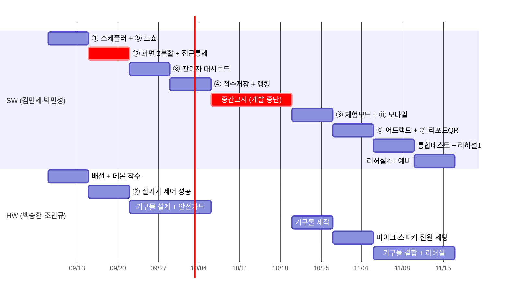

# 부록G — 작품 전시회 추가 기능 기획 및 10주 일정

> 대상: 팀 전원 · 작성 시점 2026년 9월 초 · 전시 예정 **11월 중순**
>
> **확정된 전시 방식**
> - 🙋 관람객이 **부스를 직접 체험**한다 (팀 시연만 하는 것이 아님)
> - 🔌 **라즈베리파이 실기기를 반출**한다 (도어락·릴레이가 실제로 동작)
>
> 이 두 조건이 아래 우선순위와 안전 계획을 결정했습니다. 전시 방식이 바뀌면
> **§2 우선순위**와 **§6 안전 계획**을 먼저 다시 보세요.

---

## 1. 현재 진단 — 기능 개수가 아니라 "자동으로 도는 게 없다"

코드를 확인한 결과입니다. 추가 기능보다 **이것부터**입니다.

| 항목 | 상태 | 근거 |
|---|---|---|
| 예약 시간이 되면 자동 전원 ON/OFF | ❌ **없음** | 백엔드에 스케줄러가 없다. `/simulate-entry`, `/simulate-10min-warning`, `/simulate-end` 는 모두 사람이 눌러야 동작한다 |
| 라즈베리파이 실기기 데몬 | ❌ **없음** | `pi/main.py`가 없다 (`02_karaoke_daemon_mock.py`만 존재) |
| 노래 점수 저장 | ❌ **사라짐** | `song_history` 테이블에 score 컬럼이 없다. 곡명·가수·횟수만 남는다 |
| 관리자 운영 화면 | ❌ 없음 | 탭 5개가 모두 체험용. 선생님이 볼 화면이 없다 |
| 역할(관리자/학생) 구분 | ❌ **없음** | 프론트에 권한 개념이 없다. `admin`은 인증 성공 후 띄우는 표시 문자열일 뿐이다 |
| 관리자 마스터키 보호 | ❌ **노출됨** | `VirtualBoothSimulator.tsx:466`에 9179가 하드코딩되어 있고 "관리자 비번 채우기" 버튼까지 있다 |
| 기기 제어 API 보호 | ❌ **사실상 없음** | `verify_user_auth`가 Supabase 미설정 시 무조건 통과한다. 헤더 없는 `curl`로 `/api/devices` 200을 확인했다 |
| 모바일 화면 | △ 미흡 | 레이아웃이 깨지진 않으나 제목이 두 줄로 잘리는 등 데스크톱용 |
| 중복 예약 차단 | ✅ 구현됨 | `reservations` 테이블 `UNIQUE KEY uq_date_slot` |
| 노래방 영상·반주·채점 | ✅ 구현됨 | 부록F 참고 |

> 🚨 **가장 큰 구멍**: `AGENTS.md`에 팀이 직접 적은 **1번 트리거 규칙**이
> *"예약된 이용 시간에 따라 부스 전원과 장치를 자동 제어한다"* 인데 이게 수동입니다.
> 심사위원이 가장 먼저 확인할 항목입니다.

---

## 2. 추가 기능 우선순위 (전시 방식 확정 반영)

### 🔴 1군 — 없으면 주제가 성립하지 않음

| # | 기능 | 담당 | 공수 | 왜 필수인가 |
|---|------|------|------|-------------|
| ① | **예약 시간 자동 운영 엔진** | BE | 3일 | 1분마다 도는 스케줄러가 예약 시각에 맞춰 전원 인가 → 10분 전 LED 깜빡임 → 종료곡 → 전원 차단까지 사람 손 없이 진행. **이 프로젝트의 하이라이트** |
| ② | **라즈베리파이 실기기 데몬 (`pi/main.py`)** | HW 2인 | 5일 | 실기기를 반출하기로 했으므로 필수. 화면 속 자물쇠가 아니라 **실제 도어락이 철컥 열리는 것**이 전시장 최강 임팩트 |
| ③ | **전시 체험 모드 (QR 즉석 체험권 + 대기열)** | BE+FE | 4일 | 관람객은 예약 PIN이 없다. QR → 3분 체험권 발급 → 대기 번호 → 내 차례 알림. **줄서기 문제까지 시스템이 푸는 그림** |
| ⑪ | **모바일 화면 정리** | FE | 2일 | 관람객이 **자기 폰으로** QR을 찍고 대기 순번을 본다. 체험 모드와 한 세트 |
| ④ | **점수 저장 + 실시간 랭킹** | DB+BE+FE | 3일 | 점수 컬럼 추가(선행) 후 오늘의 TOP5·명예의 전당 표시. 관람객이 순위 깨러 **다시 온다** |
| ⑥ | **무인 어트랙트 화면** | FE | 2일 | 대기 시간에 시스템 소개 + 실시간 상태 + 랭킹 자동 순환. **학생들이 종일 목이 쉬지 않는다** |
| ⑫ | **화면 3분할 + 관리자 접근 통제** | FE+BE | 3일 | 지금은 관람객이 도어락·전원을 직접 끌 수 있고 관리자 비번이 화면에 그대로 있다. **다른 기능을 만들기 전에 그릇부터 나눠야** 나중에 옮기는 일이 없다 → 상세 §3 |

**1군 소계: SW 17일 + HW 5일**

### 🟡 2군 — 심사 점수를 올림 (강력 추천)

| # | 기능 | 담당 | 공수 | 효과 |
|---|------|------|------|------|
| ⑦ | **결과 리포트 카드 QR** | FE | 3일 | 점수·등급·항목별 그래프 카드를 QR로 폰에 저장. 관람객이 **가져가는 기념품** |
| ⑧ | **관리자 운영 대시보드** | BE+FE | 4일 | 오늘 예약 현황·누적 통계·기기 상태·**원격 강제 종료**. 선생님 관점 = "학교에 실제 도입 가능한가" |
| ⑨ | **노쇼 자동 취소 + 대기자 승계** | BE | 0.5일 | ①에 얹으면 거의 공짜. 체험 모드 대기열과 직결 |

**2군 소계: 7.5일**

### 🟢 3군 — 시간이 남으면

| # | 기능 | 공수 | 비고 |
|---|------|------|------|
| ⑤ | 듀엣 대결 모드 (2인 실시간 점수 경쟁) | 4일 | 사람 모으는 데 가장 효율적. 마이크 2개 필요 |
| ⑩ | 비전 정원 초과 경고 | 2일 | YOLO가 이미 사람을 센다. 놀고 있는 `vision/` 폴더를 살리는 항목 |

### ⛔ 하지 말 것

회원가입·로그인 / 결제 / AI 음성평가 고도화 / **전면 클라우드 이관 후 원격 하드웨어 제어**.
전시 전 네트워크 리스크만 커지고 얻는 게 없습니다. (§5 참고 — 전시장은 오프라인 구성 권장)

---

## 3. 화면 분리 설계 (역할별 3분할)

### 3-1. 왜 나눠야 하나 — UX가 아니라 보안 문제

지금은 학생·관람객이 보는 화면에 **부스를 망가뜨릴 수 있는 조작이 그대로 놓여 있습니다.**
전시 방식이 "관람객 직접 체험 + 실기기 반출"로 정해졌으므로 이건 취향 문제가 아닙니다.

| 노출된 조작 | 코드 위치 | 실기기 반출 시 실제로 벌어지는 일 |
|---|---|---|
| **관리자 마스터키 9179 "채우기" 버튼** | `VirtualBoothSimulator.tsx:466` | 비번이 화면과 소스에 그대로 — 누구나 관리자 인증 |
| 도어락 직접 잠금/해제 | `:521` | 관람객이 **부스 문을 연다** |
| 릴레이 전원 직접 ON/OFF | `:533` | 남이 노래 부르는 중에 **전원이 꺼진다** |
| 이용 종료 강제 실행 | `:459` | 남의 이용 시간을 강제 종료 |
| 종료 10분 전 강제 실행 | `:452` | 엉뚱한 타이밍에 LED 경고 |
| LED·스피커 직접 제어 | `:545`, `:557` | 조명·안내음 임의 조작 |

> ⚠️ **화면만 나누면 뚫립니다.**
> `POST /api/devices/{id}/control`은 `verify_user_auth`를 달고 있지만, 이 함수는
> **Supabase가 설정되지 않은 로컬 모드에서 무조건 통과**시킵니다.
> (헤더 없는 `curl`로 `/api/devices` 200 응답을 확인했습니다.)
> 버튼을 숨겨도 전시장 Wi-Fi에 붙은 폰에서 URL을 직접 호출하면 도어락이 열립니다.
> **화면 분리와 백엔드 보호는 반드시 세트로** 갑니다.

### 3-2. 3분할 구조

보는 사람과 기기가 셋으로 나뉘므로 2분할이 아니라 3분할입니다.

| 라우트 | 대상 | 기기 | 담을 것 |
|--------|------|------|---------|
| `/` | 학생·관람객 | **폰** | 예약 신청, 체험권 QR·대기열, 내 노래 기록, 미니게임 |
| `/booth` | 부스 이용자 | **대형 화면** | 노래방 영상·반주·채점, 랭킹, 어트랙트 |
| `/admin` | 선생님 | 노트북 | 기기 제어, 시나리오 강제 실행, 예약·통계, 강제 종료 |

Next.js App Router라 `app/booth/page.tsx`, `app/admin/page.tsx` 폴더만 만들면 되고,
기존 컴포넌트는 그대로 옮겨 붙입니다.

### 3-3. 현재 5개 탭 재배치

| 현재 탭 | 옮길 곳 |
|---------|---------|
| 가상 부스 관제 & 키패드 시뮬레이터 | **`/admin` 전부** (관람객에게 절대 노출 금지) |
| 노래방 예약 신청 & PIN 발급 | 신청은 `/` · 조회·취소는 `/admin` |
| 실시간 노래방 반주 & 채점 | `/booth` |
| 나의 18번 & 노래 기록 | 내 기록은 `/` · 전체 통계는 `/admin` |
| 노래 퀴즈 미니게임 | `/` (대기열에서 기다릴 때 딱 맞다) |

### 3-4. 접근 통제는 어디까지

본격 로그인·회원가입은 §2의 "하지 말 것"에 그대로 둡니다(10주 일정에 맞지 않음).
대신 이 정도가 현실적인 절충입니다.

- [ ] `/admin` 진입 시 관리자 PIN을 **백엔드가 검증** — 프론트 소스에서 9179 제거
- [ ] 같은 검증을 `POST /api/devices/{id}/control` 과 `/api/booth/simulate-*` 에도 적용
- [ ] `/` 와 `/booth` 는 무인증 유지 (관람객이 바로 써야 하므로)
- [ ] 관리자 PIN은 코드가 아니라 `.env`로 뺀다 (`.agents/rules/security-rules.md`)

> 🚨 **이 두 가지는 지금 상태로 전시장에 나가면 안 됩니다**:
> ① 프론트 소스의 9179 노출, ② 기기 제어 API 무인증.
> 나머지 화면 이동은 시간을 두고 해도 되지만 이 둘은 우선 처리 대상입니다.

### 3-5. 부록G 기능과 라우트의 대응

새로 생긴 일이 아니라, **§2에 이미 잡아둔 기능을 그릇에 나눠 담는 것**입니다.

| 라우트 | 여기에 들어갈 §2 기능 |
|--------|------------------------|
| `/` | ③ 체험 모드 + ⑪ 모바일 화면 정리 |
| `/booth` | ⑥ 어트랙트 화면 + ④ 랭킹 표시 + 기존 노래방 |
| `/admin` | ⑧ 관리자 운영 대시보드 + ① 스케줄러 상태 확인 |

그래서 ⑫의 공수는 **라우트 분리 1.5일 + 접근 통제 1.5일 = 3일**입니다.
다만 **③⑥⑧보다 먼저** 해야 합니다. 나중에 하면 만들어 둔 화면을 다시 옮겨야 합니다.

### 3-6. 시연에서도 유리하다

한 화면에 다 있는 편이 시연에 좋아 보이지만, 실제로는
**폰(관람객) + 부스 대형 화면 + 관리자 노트북 3개를 동시에 보여주는 쪽**이 훨씬 강력합니다.
"역할별로 화면을 나눠 설계했다"는 것 자체가 정보통신과 프로젝트의 설명거리이고,
심사위원이 "학교에 실제로 도입 가능한가"를 판단할 때 바로 걸리는 지점입니다.

---

## 4. 공수 총계와 가용 시간

```
필수(1군)    SW 17일 + HW 5일     (⑫ 화면 3분할 3일 포함)
추천(2군)    SW 7.5일
선택(3군)    SW 6일
─────────────────────────────
SW 합계      24.5일(필수+추천)  ~  30.5일(전부)
```

- SW 2인(김민제·박민성) × 실작업 7주 × 주 3일 = **약 42 사람·일 가용**
- 필수+추천 24.5일 → **여유 있음.** 3군까지 해도 들어갑니다
- HW 2인(백승환·조민규)은 실기기 반출 결정으로 **데몬 + 기구물 + 안전 가드**까지 계속 바쁩니다

---

## 5. 10주 일정 (9/8 ~ 11/16)



| 주차 | SW 2인 | HW 2인 |
|---|---|---|
| 1주 (9/8~) | ① 스케줄러 + ⑨ 노쇼 자동취소 | 배선, 데몬 착수 |
| **2주 (9/15~)** | **⑫ 화면 3분할 + 관리자 접근 통제** (§3) | ② `pi/main.py` 실기기 제어 성공 |
| 3주 (9/22~) | ⑧ 관리자 대시보드 → `/admin`에 얹음 | 기구물 설계 + **안전 가드 설계** |
| 4주 (9/29~) | ④ 점수 DB 스키마 + 랭킹 | 기구물 제작 |
| **5~6주 (10/6~)** | **🚨 중간고사 — 개발 중단.** 포스터·발표자료·시연 시나리오 문서만 | |
| 7주 (10/20~) | ③ 체험 모드 + ⑪ 모바일 → `/` 완성 | 부스 조립 |
| 8주 (10/27~) | ⑥ 어트랙트 + ⑦ 리포트 QR → `/booth` 완성 | 마이크·스피커·전원 세팅 |
| 9주 (11/3~) | 통합 테스트 + **리허설 1차** (여유 시 ⑤ 대결 · ⑩ 정원 경고) | 기구물 결합 |
| 10주 (11/10~) | **리허설 2차** + 버그 + 백업 계획 | 예비 |

> 📌 중간고사 일정이 다르면 **5~6주 블록을 통째로 이동**하고 나머지를 밀면 됩니다.
> 9~10주(리허설 2주)는 **절대 줄이지 마세요.** 전시 사고는 대부분 여기서 잡힙니다.
>
> 📌 **⑫를 2주차로 당긴 이유**: `/admin`·`/booth`라는 그릇을 먼저 만들어야
> ⑧③⑥을 처음부터 제자리에 만들 수 있습니다. 나중에 하면 화면을 두 번 옮깁니다.

---

## 6. 🚨 안전 계획 (실기기 반출 + 불특정 다수 체험)

이 조합은 임팩트가 가장 크지만 **책임도 가장 큽니다.** 아래는 협상 대상이 아닙니다.

### 6-1. 전기 안전

- [ ] 릴레이가 제어하는 것은 **저전압(5V/12V) 기기만.** 220V 직결 금지
- [ ] 노출 배선 0 — 모든 배선은 기구물 안에 수납하고 관람객 손이 닿지 않게 한다
- [ ] 라즈베리파이·전원부는 **잠금 가능한 케이스**에 넣는다
- [ ] 멀티탭은 과부하 차단 기능이 있는 제품, 연장선은 통행로에 테이프 고정
- [ ] 배선 작업은 **전원 차단 상태 + 교사 입회** (로드맵 2단계와 동일)

### 6-2. 도어락 손끼임

- [ ] 솔레노이드 동작부에 **손가락이 들어가지 않는 가드**를 씌운다
- [ ] 도어락은 **실물 문이 아닌 데모 패널**에 장착 (사람이 갇힐 수 없게)
- [ ] "동작 중 손대지 마세요" 표지 부착

### 6-3. 관람객 위생·질서

- [ ] 마이크 **일회용 커버** 또는 매 체험 후 소독 티슈
- [ ] 1인 **3분 타이머 강제** (체험 모드 ③에 내장)
- [ ] 대기 줄 유도선, 안전요원 역할 1명 상시 배치

### 6-4. 소음

- [ ] 주변 부스 민원 대비 — 부스 방음재 또는 **헤드폰 모니터링 옵션**
- [ ] 전시 시작 전 주최 측에 음향 사용 사전 협의

### 6-5. 시스템 접근 통제

물리 안전만큼 중요합니다. 상세는 **§3-4**, 여기서는 전시 당일 최종 확인용입니다.

- [ ] 관람객 폰(`/`)에서 도어락·전원 제어 버튼이 **보이지 않는다**
- [ ] 프론트 소스에 관리자 비번 9179가 **남아 있지 않다**
- [ ] `curl`로 `POST /api/devices/door_lock_1/control`을 쳐 봤을 때 **거부된다**
- [ ] `/admin`은 선생님 노트북에서만 열어 두고, 자리를 비울 때 화면을 잠근다

---

## 7. 🌐 네트워크 구성 (실기기 반출 시 필수)

전시장 공용 Wi-Fi에 의존하면 **라즈베리파이 ↔ 백엔드 통신이 끊기는 순간 부스가 죽습니다.**

**권장 구성 — 부스 안에서 폐쇄망을 만든다**

```
[노트북: 백엔드 + 프론트 + DB]  ←── 유선/전용 공유기 ──→  [라즈베리파이 5]
              ↑
              └── 전용 공유기 Wi-Fi ── [관람객 폰: QR 체험권·대기열]
```

- [ ] **소형 공유기를 직접 가져간다** (전시장 Wi-Fi에 의존하지 않는다)
- [ ] `pi/.env`의 `BACKEND_URL`을 공유기 내부 IP로 고정 (DHCP 고정 할당)
- [ ] 노트북 방화벽 8000 포트 인바운드 허용 확인
- [ ] **클라우드 배포본은 백업용으로만.** 현장 제어는 로컬로 돈다
- [ ] 유튜브 노래방 영상은 외부 인터넷이 필요하므로, **로컬 반주 파일을
      `public/media/karaoke/`에 미리 넣어 둔다** → 부록F §4 ②③ 경로

---

## 8. 전시 당일 운영 시나리오 (관람객 동선)

> 각 단계가 **어느 화면(§3-2)** 에서 일어나는지 함께 적었습니다.
> 📱 `/` = 관람객 폰 · 📺 `/booth` = 부스 대형 화면 · 💻 `/admin` = 선생님 노트북

```
① 부스 앞 안내판 QR 촬영                                    📱
      ↓
② 폰에서 체험 신청 → 대기 번호 발급 (예: 7번, 앞에 2팀)      📱
      ↓
③ 어트랙트 화면이 대기 순번과 현재 랭킹을 순환 표시          📺
      ↓
④ 내 차례 → 폰에 4자리 체험 PIN 도착                        📱
      ↓
⑤ 실물 키패드에 PIN 입력 → 🔓 도어락 + 전원 + LED           🔌 실기기
      ↓
⑥ 애창곡 TOP10 중 선곡 → 가창 (3분 타이머)                  📺
      ↓
⑦ 곡 종료 → 자동 채점 → 점수·등급 발표                      📺
      ↓
⑧ 결과 리포트 카드 QR → 관람객이 폰에 저장 (기념품)          📺 → 📱
      ↓
⑨ 랭킹 등재 → 어트랙트 화면에 이름이 뜬다                    📺
      ↓
⑩ 종료 안내 + 전원 차단 → 다음 대기자 호출                   📺 / 💻
```

문제가 생겼을 때(멈춤·전원 이상·순서 꼬임) 손대는 곳은 **선생님의 `/admin` 화면 한 곳**입니다.
관람객 화면에는 손댈 버튼이 아예 없어야 정상입니다.

**설명 담당자가 강조할 3문장**
1. "예약 시간이 되면 **사람 없이** 전원이 들어오고 나갑니다" (①)
2. "지금 열린 저 도어락은 **화면이 아니라 실제 기기**입니다" (②)
3. "관람객이 만든 점수가 **저 랭킹판에 바로 올라갑니다**" (④)

---

## 9. 착수 전 확인할 것

- [ ] 중간고사 정확한 날짜 → §4 일정의 5~6주 블록 조정
- [ ] 전시 부스 크기·전원 콘센트 개수·소음 허용 여부 주최 측 확인
- [ ] 마이크 2개 확보 가능한가 (⑤ 대결 모드 진행 여부 결정)
- [ ] 소형 공유기 확보 (§7)
- [ ] 로컬 반주 음원 확보 계획 (부록F §4 ②③ · `LICENSE-LEDGER.md` 기록)
- [ ] 관리자 PIN을 9179로 계속 쓸지, `.env`로 옮기며 새 값으로 바꿀지 (§3-4)

---

## 10. 관련 문서

- [부록F — 노래방 미디어 저작권 검토 및 구현 계획](부록F-노래방-미디어-저작권-검토-및-구현계획.md) — 반주·영상 확보 경로
- [02 — 학생 수작업 로드맵](02-학생-수작업-로드맵.md) — 2단계가 위 ② 항목
- [03 — 2차 개발 생성형 AI 핸드오버 가이드](03-2차개발-생성형AI-핸드오버-가이드.md) — 기능 구현 시 프롬프트 템플릿
- [부록A — 백엔드↔라즈베리파이5 연동 인터페이스 가이드](부록A-백엔드-라즈베리파이5-연동-인터페이스-가이드.md) — ② 구현 시 REST 계약
